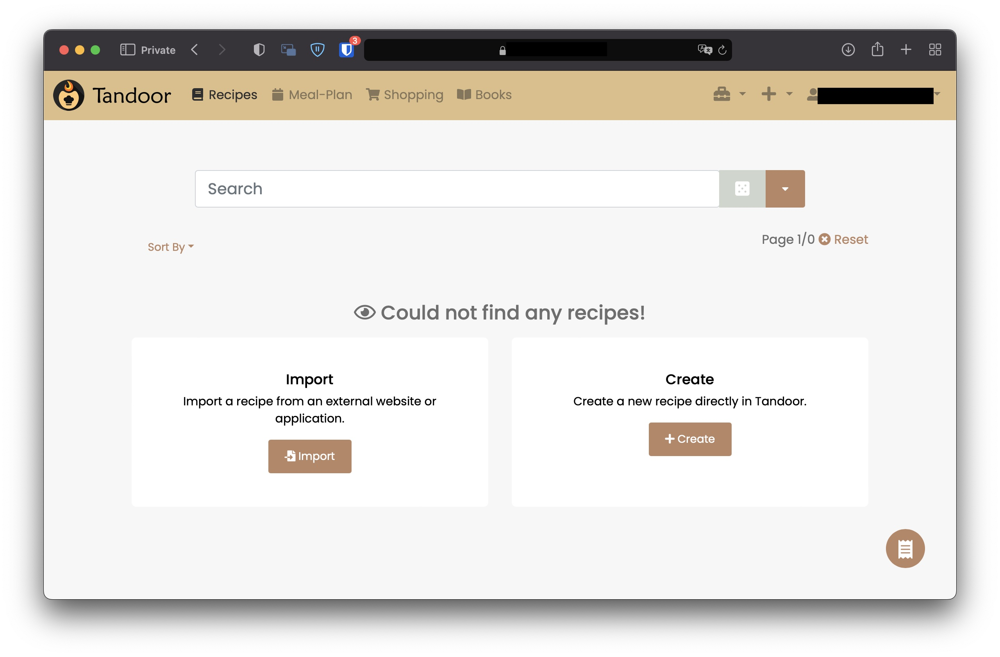

<!--
NOTA: Este README foi creado automáticamente por <https://github.com/YunoHost/apps/tree/master/tools/readme_generator>
NON debe editarse manualmente.
-->

# Tandoor para YunoHost

[](https://ci-apps.yunohost.org/ci/apps/tandoor/)


[](https://install-app.yunohost.org/?app=tandoor)

*[Le este README en outros idiomas.](./ALL_README.md)*

> *Este paquete permíteche instalar Tandoor de xeito rápido e doado nun servidor YunoHost.*  
> *Se non usas YunoHost, le a [documentación](https://yunohost.org/install) para saber como instalalo.*

## Vista xeral

This application is meant for people with a collection of recipes they want to share with family and friends or simply
store them in a nicely organized way. A basic permission system exists but this application is not meant to be run as 
a public page.

### Core Features

- 🥗 **Manage your recipes** - Manage your ever growing recipe collection
- 📆 **Plan** - multiple meals for each day
- 🛒 **Shopping lists** - via the meal plan or straight from recipes
- 📚 **Cookbooks** - collect recipes into books
- 👪 **Share and collaborate** on recipes with friends and family

### Made by and for power users

- 🔍 Powerful & customizable **search** with fulltext support and [TrigramSimilarity](https://docs.djangoproject.com/en/3.0/ref/contrib/postgres/search/#trigram-similarity)
- 🏷️ Create and search for **tags**, assign them in batch to all files matching certain filters
- ↔️ Quickly merge and rename ingredients, tags and units 
- 📥️ **Import recipes** from thousands of websites supporting [ld+json or microdata](https://schema.org/Recipe)
- ➗ Support for **fractions** or decimals
- 🎨 Customize your interface with **themes**
- 📦 **Sync** files with Dropbox and Nextcloud
  
### All the must haves

- 📱Optimized for use on **mobile** devices
- 🌍 localized in many languages thanks to the awesome community
- 📥️ **Import your collection** from many other [recipe managers](https://docs.tandoor.dev/features/import_export/)
- ➕ Many more like recipe scaling, image compression, printing views and supermarkets

**Versión proporcionada:** 1.5.30~ynh1

**Demo:** <https://app.tandoor.dev/accounts/login/?demo>

## Capturas de pantalla



## Documentación e recursos

- Web oficial da app: <https://tandoor.dev>
- Documentación oficial para usuarias: <https://docs.tandoor.dev>
- Documentación oficial para admin: <https://docs.tandoor.dev>
- Repositorio de orixe do código: <https://github.com/TandoorRecipes/recipes>
- Tenda YunoHost: <https://apps.yunohost.org/app/tandoor>
- Informar dun problema: <https://github.com/YunoHost-Apps/tandoor_ynh/issues>

## Info de desenvolvemento

Envía a túa colaboración á [rama `testing`](https://github.com/YunoHost-Apps/tandoor_ynh/tree/testing).

Para probar a rama `testing`, procede deste xeito:

```bash
sudo yunohost app install https://github.com/YunoHost-Apps/tandoor_ynh/tree/testing --debug
ou
sudo yunohost app upgrade tandoor -u https://github.com/YunoHost-Apps/tandoor_ynh/tree/testing --debug
```

**Máis info sobre o empaquetado da app:** <https://yunohost.org/packaging_apps>
